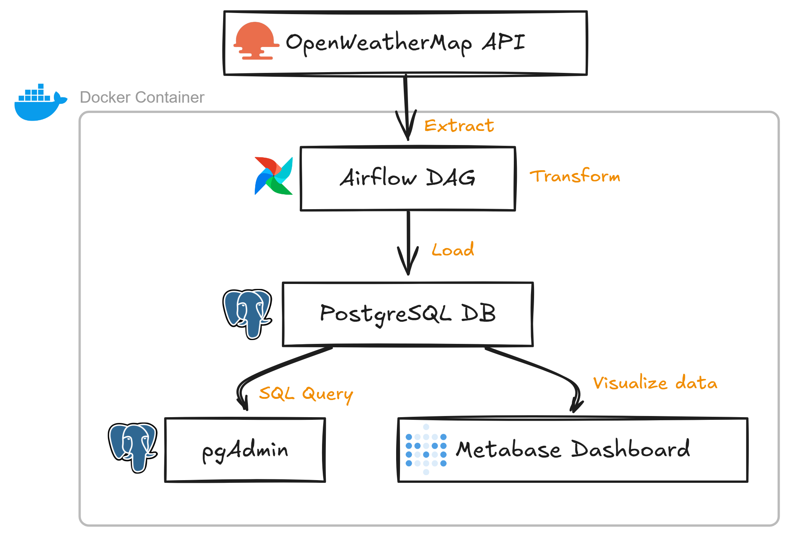

# OpenWeather ETL Data Pipeline

This project demonstrates a complete, containerized ETL (Extract, Transform, Load) data pipeline. It automatically fetches daily weather data for major UK cities from the OpenWeatherMap API, stores it in a PostgreSQL database, and provides tools for visualization and analysis.

The entire infrastructure is managed by Docker Compose, making it easy to set up and run with a single command.

## Table of Contents

- [Project Overview](#project-overview)
- [Tech Stack & Architecture](#tech-stack--architecture)
- [Prerequisites](#prerequisites)
- [Setup & Installation](#setup--installation)
- [How to Use](#how-to-use)
- [Project Structure](#project-structure)
- [Environment Variables](#environment-variables)

## Project Overview

The core goal of this project is to create a reliable, automated system for collecting and analyzing weather data.

*   **Extract:** An Apache Airflow DAG (Directed Acyclic Graph) runs on a daily schedule. It calls the OpenWeatherMap API to fetch the current temperature, humidity, and weather description for 10 major UK cities.
*   **Transform:** The raw JSON data from the API is parsed and structured into a clean format within the Python script.
*   **Load:** The cleaned data is then loaded into a `weather` table in a PostgreSQL database for persistent storage.

This stored data can then be queried directly using pgAdmin or visualized through interactive dashboards in Metabase.

## Tech Stack & Architecture

This project uses a set of powerful, open-source tools that work together seamlessly. Think of it as a team where each member has a specific job:

*   **Docker & Docker Compose:** The foundation of the project. Docker acts as a "shipping container" for each application (Postgres, Airflow, etc.), ensuring they run the same way everywhere. Docker Compose is the "logistics manager" that defines and runs the entire multi-container application.
*   **Apache Airflow:** The "Orchestrator" or "Project Manager". It's responsible for scheduling and running our data collection script (`weather_etl.py`) automatically every day.
*   **PostgreSQL:** The "Data Warehouse". A robust relational database used to store all the historical weather data we collect.
*   **Metabase:** The "Business Intelligence Dashboard". A user-friendly tool that connects to our PostgreSQL database and allows us to create charts, graphs, and dashboards to visualize the weather trends.
*   **pgAdmin:** The "Database Toolkit". A web-based administration tool for PostgreSQL. It allows us to look directly inside the database, manage tables, and run SQL queries manually.
*   **Python:** The primary programming language used for the data fetching and processing logic, with libraries like `requests` and `psycopg2`.

### Architecture Diagram

For a visual representation of how these components interact, please see the diagram below:



## Prerequisites

Before you begin, ensure you have the following installed on your system:

1.  **Docker and Docker Compose:** [Official installation guide](https://docs.docker.com/get-docker/)
2.  **An OpenWeatherMap API Key:** You'll need to sign up for a free account on the [OpenWeatherMap website](https://openweathermap.org/appid) to get an API key.

## Setup & Installation

Follow these steps to get the project up and running:

1.  **Clone the Repository**
    ```bash
    git clone https://github.com/your-username/openweather-data-pipeline.git
    cd openweather-data-pipeline
    ```

2.  **Create an Environment File**
    Create a file named `.env` in the root directory of the project. This file will store your secret keys and configuration settings. You can create it from scratch or copy the example if you have one.

3.  **Update the `.env` File**
    Open the newly created `.env` file and add the following configuration. You must provide your own `OPENWEATHER_API_KEY`.

    ```text
    # .env file
    POSTGRES_USER=airflow
    POSTGRES_PASSWORD=airflow
    POSTGRES_DB=airflow

    PGADMIN_DEFAULT_EMAIL=admin@example.com
    PGADMIN_DEFAULT_PASSWORD=admin

    AIRFLOW_USER=airflow
    AIRFLOW_PASSWORD=airflow

    OPENWEATHER_API_KEY=your_actual_api_key_here
    ```

4.  **Build and Run the Containers**
    Use Docker Compose to build the images and start all the services in detached mode (`-d`).

    ```bash
    docker-compose up -d --build
    ```
    This command might take a few minutes the first time as it downloads the necessary images.

5.  **Verify the Services**
    Check that all containers are running correctly:
    ```bash
    docker ps
    ```
    You should see containers for `postgres`, `pgadmin`, `airflow`, and `metabase`.

## How to Use

Once the containers are running, you can access the different services through your web browser:

### 1. Apache Airflow

*   **URL:** `http://localhost:8080`
*   **Login:** Use the `AIRFLOW_USER` and `AIRFLOW_PASSWORD` from your `.env` file.
*   **Action:**
    1.  On the main dashboard, you will see a DAG named `weather_etl`.
    2.  Click the toggle button on the left to enable it.
    3.  Airflow will automatically trigger the first run. You can also trigger it manually by clicking the "play" button on the right.

### 2. Metabase

*   **URL:** `http://localhost:3000`
*   **Action:**
    1.  The first time you access Metabase, it will guide you through a setup process.
    2.  When asked to add a database, select **PostgreSQL**.
    3.  Use the following settings to connect to your database. **Important:** The host is `postgres`, which is the service name defined in `docker-compose.yml`.
        *   **Host:** `postgres`
        *   **Port:** `5432`
        *   **Database Name:** The `POSTGRES_DB` value from your `.env` file.
        *   **Username:** The `POSTGRES_USER` value from your `.env` file.
        *   **Password:** The `POSTGRES_PASSWORD` value from your `.env` file.
    4.  Once connected, you can start exploring the `weather` table and building visualizations!

### 3. pgAdmin

*   **URL:** `http://localhost:5050`
*   **Login:** Use the `PGADMIN_DEFAULT_EMAIL` and `PGADMIN_DEFAULT_PASSWORD` from your `.env` file.
*   **Action:**
    1.  After logging in, you need to register a new server.
    2.  Right-click on "Servers" -> "Create" -> "Server...".
    3.  In the "General" tab, give it a name (e.g., "Weather DB").
    4.  In the "Connection" tab, use the same database credentials as for Metabase.
        *   **Host name/address:** `postgres`
        *   **Port:** `5432`
        *   **Maintenance database:** The `POSTGRES_DB` value.
        *   **Username:** The `POSTGRES_USER` value.
        *   **Password:** The `POSTGRES_PASSWORD` value.
    5.  Click "Save". You can now browse the database, view the `weather` table, and run SQL queries.

## Project Structure

```text
.
├── dags
│   └── weather_etl.py         # The Airflow DAG and Python logic for the ETL process.
├── images
│   └── project_architecture_diagram.png # System architecture diagram.
├── postgres
│   └── init.sql               # SQL script to create the 'weather' table on startup.
├── .env                       # Your local environment variables (ignored by git).
├── docker-compose.yml         # Defines all the services, networks, and volumes.
└── README.md                  # This file.
```

## Environment Variables

All configuration is managed through the `.env` file to keep secrets out of the main codebase.

| Variable                   | Description                                          |
| -------------------------- | ---------------------------------------------------- |
| `POSTGRES_USER`            | Username for the PostgreSQL database.                |
| `POSTGRES_PASSWORD`        | Password for the PostgreSQL database.                |
| `POSTGRES_DB`              | Name of the PostgreSQL database.                     |
| `PGADMIN_DEFAULT_EMAIL`    | The default email to log into the pgAdmin interface. |
| `PGADMIN_DEFAULT_PASSWORD` | The default password for the pgAdmin user.           |
| `AIRFLOW_USER`             | The username for the Airflow web UI.                 |
| `AIRFLOW_PASSWORD`         | The password for the Airflow web UI.                 |
| `OPENWEATHER_API_KEY`      | **Required.** Your personal API key from OpenWeather.  |